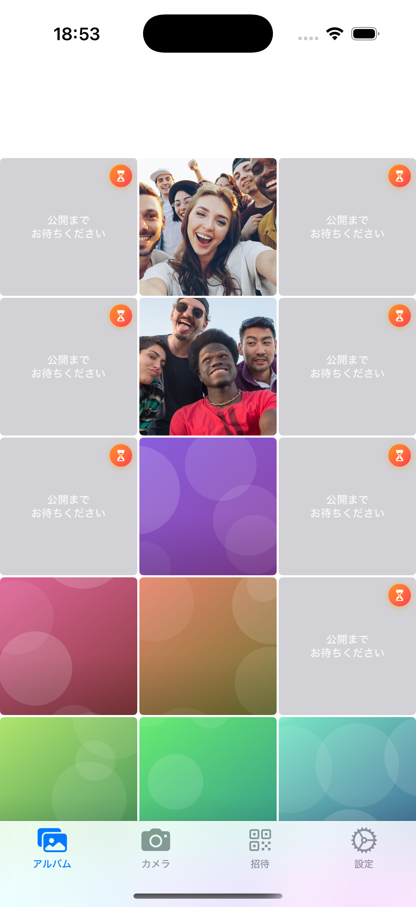
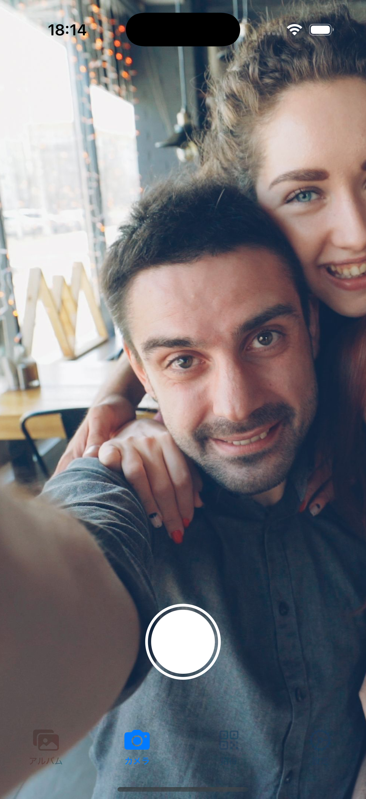
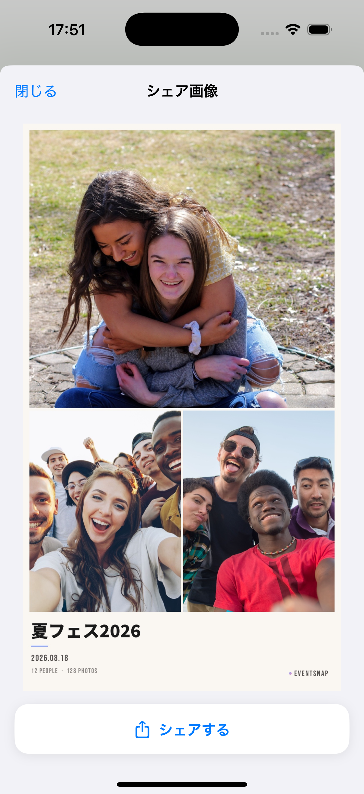

# EventSnap

イベント専用の、その場にいる人だけで完結する思い出共有アプリ

## 概要

EventSnapは、文化祭・旅行・パーティーなどの少人数イベントで、参加者全員の写真をリアルタイムに1つのアルバムへ集められるiOSアプリです。参加はQRコードを読み取るだけ。招待コードのような、その場にいなくても入れる経路はあえて用意していません。

メインアプリ・ホーム画面ウィジェット/ロック画面Live Activity・App Clip（閲覧専用プレビュー）の3ターゲット構成です。

> 累計1,400万人のヘルスケアアプリ「あすけん」の成長施策を調べ、EventSnapに何が使えるかを整理した資料は
> [`docs/ASKEN_GROWTH_CASE_STUDY.md`](docs/ASKEN_GROWTH_CASE_STUDY.md)。
> 招待・通知・法人向け展開を検討する前に読むこと。

### 主な機能

- **QRコードによる即席グループ生成**: イベント作成と同時にQRコードを表示。参加はその場でQRを読み取った人だけ
- **撮影と同時の自動共有**: 撮った写真はその場でイベント参加者全員のアルバムに自動で並ぶ（投稿ボタンはない）
- **あとで公開（タイムカプセル）**: 撮影者が選んだ、または一定確率で自動選定された写真を最短6時間・最長2週間伏せておき、参加者全員に一斉公開する
- **Event Reel（自動編集シェア画像）**: 「シェアOK」にした写真が数枚集まるたびに、EventSnapが自動で1枚の縦長シェア画像を生成する（Editorial/Bold/Minimalの3テンプレート＋フォトダンプ風グリッドテンプレート）
- **Live Activity / ホーム画面ウィジェット**: ロック画面・Dynamic Islandからイベントの進行状況を確認し、シャッターやアルバムへワンタップで戻れる
- **初回インタラクティブチュートリアル**: 実際のUIをスポットライトでハイライトしながら、シャッター・シェアOK・あとで公開の使い方を体験できる
- **App Clip（閲覧専用プレビュー）**: アプリ未インストールでもQRコードからイベントの今の様子（写真・Event Reel風のプレビュー）をその場で見られ、フルアプリのダウンロードに繋げる

## ターゲット構成

| ターゲット | 役割 |
| --- | --- |
| `EventSnap2` | メインアプリ本体 |
| `EventSnapWidget` | ホーム画面ウィジェット＋ロック画面/Dynamic Island Live Activity |
| `EventSnapClip` | App Clip。イベントの様子を閲覧専用で見せ、フルアプリのダウンロードに繋げる（撮影機能は持たない） |

## 技術スタック

- **UI**: SwiftUI
- **データ同期**: CloudKit Public Database（自前サーバー不要・完全無料）
- **カメラ**: AVFoundation
- **写真解析**: Vision + CoreImage（顔・人物・注目領域を検出し、Event Reelの構図・文字配置を自動決定するために使用。美肌加工などのフィルター処理は行わない）
- **ロック画面/ウィジェット**: WidgetKit + ActivityKit
- **参加導線**: QRコード（アプリ内スキャナ）＋ App Clip / Universal Link

## 必要要件

- Xcode 16以上
- iOS 18以上（実機推奨。CloudKit・カメラ・Live Activityが絡むため、シミュレータでは一部機能を確認できません）
- Apple Developer Program アカウント（App Groups・iCloud・Push Notificationsの実機テストに必須）
- 実機2台以上（複数人での共有を確認する場合）

## セットアップ手順

### 1. プロジェクトを開く

このリポジトリをクローンし、`EventSnap2.xcodeproj` をXcodeで開きます（新規プロジェクトの作成は不要です。3ターゲットとも既に構成済みです）。

```bash
git clone <このリポジトリのURL>
open EventSnap2.xcodeproj
```

### 2. Bundle Identifier / Teamを差し替える

自分のApple Developerアカウントでビルドするには、3ターゲットすべてでBundle IdentifierとTeamを変更します。

| ターゲット | 現在のBundle Identifier |
| --- | --- |
| `EventSnap2` | `app.takaoka.com.EventSnap2` |
| `EventSnapClip` | `app.takaoka.com.EventSnap2.AppClip`（`EventSnap2`の子として設定すること） |
| `EventSnapWidget` | `app.takaoka.com.EventSnap2.Widget`（`EventSnap2`の子として設定すること） |

### 3. Capabilities設定

各ターゲットの `Signing & Capabilities` タブで以下を確認・設定します。

**EventSnap2（メインアプリ）**
- **iCloud**: `CloudKit` にチェック、コンテナに `iCloud.<あなたのBundle ID>` を追加
- **Push Notifications**
- **Background Modes**: `Background fetch` / `Remote notifications`
- **App Groups**: `group.<あなたのBundle ID>`
- **Associated Domains**: `applinks:` / `appclips:`（後述の手順4で用意する自分のドメイン）

**EventSnapWidget**
- **App Groups**: メインアプリと同じグループ

**EventSnapClip**
- **Associated Domains**: `appclips:` / `applinks:`（メインアプリと同じドメイン）
- ⚠️ **iCloud（CloudKit）は追加しません。App ClipのApp IDにはiCloud capabilityが存在しない**ため、
  entitlementsに書くと「Provisioning profile ... doesn't match the entitlements file's value for
  the com.apple.developer.icloud-services entitlement」で署名に失敗します。
  App Clipはネットワークアクセスを持たない案内画面だけの構成です。

メインアプリとWidgetは同じiCloudコンテナ・App Groupを指すように揃えてください。ズレるとCloudKit同期やWidgetへのデータ受け渡しが動きません。

### 4. QRコード / App Clipのドメインを設定する

`Services/AppLinkConfig.swift` の `host` が検証用の予約ドメインのままだと、アプリ内蔵のQRスキャナ以外（標準カメラアプリ・App Clip・Universal Link）からは参加できません。自分のドメインに差し替え、`.well-known/apple-app-site-association` を配信してください（`AppLinkConfig.swift` 内のコメントに手順の詳細があります）。

### 5. CloudKitスキーマを作成する

[CloudKit Dashboard](https://icloud.developer.apple.com/dashboard/) で、あなたのコンテナに以下のレコードタイプを作成します。

#### `Event`
| フィールド名 | 型 | インデックス |
| --- | --- | --- |
| id | String | Queryable |
| name | String | - |
| createdAt | Date/Time | Sortable |
| creatorID | String | - |
| participantIDs | String（List） | - |
| photoCount | Int(64) | - |
| isActive | Int(64) | - |
| endedAt | Date/Time | - |

#### `Photo`
| フィールド名 | 型 | インデックス |
| --- | --- | --- |
| id | String | Queryable |
| eventID | String | Queryable |
| uploaderID | String | - |
| uploaderName | String | - |
| uploadedAt | Date/Time | Sortable |
| imageAsset | Asset | - |
| thumbnailAsset | Asset | - |
| filterName | String | - |
| aiProcessed | Int(64) | - |
| isTimeCapsule | Int(64) | - |
| revealDate | Date/Time | Sortable（任意） |
| isShareOK | Int(64) | - |

`Security Roles` は `Public` を選び、Read: `World` / Write: `Authenticated` に設定します。各フィールドの用途・追加の背景は `docs/CLOUDKIT_MIGRATION.md` を参照してください。

### 6. ビルド・実機テスト

1. `EventSnap2` スキームを選び、実機をターゲットに `Cmd + R`
2. 1台目でイベントを作成 → QRコードを表示
3. 2台目（別のApple IDを推奨）でQRコードを読み取って参加
4. Widget/Live Activityを確認する場合は `EventSnapWidget` スキームも一度実行し、ホーム画面にウィジェットを追加
5. App Clipの動作は `EventSnapClip` スキーム、または実機でQRコードを読み取って確認します（本番でのApp Clip起動には、App Store ConnectでのApp Clip Experienceの登録が別途必要です）

> ⚠️ **撮影モードについて**: `Preview/ScreenshotMode.swift` の `ScreenshotMode.isActive` は、
> 起動引数 `-EventSnapScreenshot 1` が渡されたときだけ true になります。撮影モードで起動すると
> CloudKitへの読み書き・カメラ・通知がすべて無効化され、固定のFixtureデータしか表示されません
> （＝ホーム画面に到達できず、イベントを作成する導線を通れません）。
> **この値を `return true` のような固定値に書き換えないでください。** 撮影したいときは
> `EventSnap2` スキームの Run > Arguments にあるチェックボックスをオンにしてください。

## App Store提出用スクリーンショット

実データを使わず、本番のViewに固定Fixtureを注入して再現性のあるスクリーンショットを撮る仕組みがあります。手順は `docs/APP_STORE_SCREENSHOTS.md` を参照してください。

```bash
./scripts/capture_screenshots.sh
```

## スクリーンショット

| タイムカプセル | カメラ | Event Reel |
| --- | --- | --- |
|  |  |  |

## トラブルシューティング

### CloudKitエラー

**症状**: "CloudKit error: Account not found" / 実機でイベント作成・参加ができない
**解決**: 実機の設定アプリでiCloudにサインインしているか確認する。シミュレータではCloudKitの一部操作が不安定なため、実機での確認を推奨

**症状**: "Permission denied"
**解決**: CloudKit DashboardのSecurity Rolesで `Public` のRead/Write権限を確認する

**症状**: 実データではなく毎回同じ写真しか出てこない
**解決**: 上記セットアップ手順6の注意事項（`ScreenshotMode.isActive` のハードコード）を確認する

### QRコードから参加できない（標準カメラ・App Clip経由）

**症状**: 標準のカメラアプリでQRを読んでもSafariが開くだけで何も起きない
**解決**: `AppLinkConfig.host` が予約ドメインのままになっていないか確認する（上記セットアップ手順4参照）

### カメラが起動しない

**症状**: 黒い画面のまま
**解決**: `Info.plist` に `NSCameraUsageDescription` が設定されているか、デバイスの設定 > プライバシー > カメラ で権限が許可されているかを確認する

### ビルドエラー

**症状**: "No such module 'CloudKit'" 等
**解決**: 対象ターゲットのCapabilitiesでiCloud（CloudKit）が有効になっているか確認する。App Clip/Widgetターゲットでのビルドエラーは、そのターゲットのTarget Membershipに必要なファイルが含まれているか確認する

## 実装済み機能

- [x] QRコードによるイベント参加（招待コード等の代替経路は「その場にいた人だけ」を守るためあえて用意しない）
- [x] 撮影と同時の自動アルバム反映
- [x] タイムカプセル（あとで公開）の自動選定・強制指定・一斉公開
- [x] Event Reel自動生成（Editorial/Bold/Minimal＋フォトダンプ風グリッド）
- [x] Live Activity / Dynamic Island / ホーム画面ウィジェット
- [x] 公開通知（ローカル通知）
- [x] 初回インタラクティブチュートリアル
- [x] App Clip（閲覧専用プレビュー）
- [x] 複数イベントの参加履歴・切り替え

## 既知の課題 / 今後の対応

- `Services/AppLinkConfig.swift` の `host` を実ドメインに差し替え、Universal Link/App Clipを本番運用可能にする
- `Preview/ScreenshotMode.swift` の `isActive` が撮影モード固定のハードコードのままになっている（上記セットアップ手順6参照）
- `GridPhotoDumpRenderer`（フォトダンプ風テンプレート）はレンダラーとして実装済みだが、まだUI上でユーザーが選べるようにはなっていない
- 美肌加工・フィルター機能は現時点では未実装（`Photo.filterName` はデータモデル上は用意されているが、実際に値を設定する経路が無い）

## ライセンス

このプロジェクトはMITライセンスの下で公開されています。

## 作者

アプリ甲子園2024参加者

## サポート

問題が発生した場合は、Issuesセクションで報告してください。
